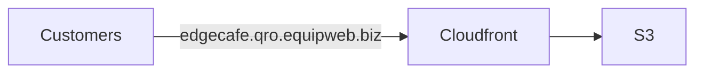
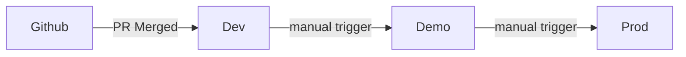

# infra

## Infrastructure

The fundamental setup involves storing the compiled code in an S3 bucket and distributing it through CloudFront. The domain name will be directed to the CloudFront CNAME.



### Naming convention

POS API URL format: `https://<server-domain>/<client-name>/ordering/api`
QRO(QR Ordering) domain name: `https://<client-name>(-<stage-name>).qro.equipweb.biz`

During build time, we will pass the `VITE_API_URL` template:

```env
VITE_API_URL=https://t1.equipweb.biz/<client-name>/ordering/api
```

**\<server-name\>** - Domain name of the server. We currently have 3 of the:

- s1.equipweb.biz
- s2.equipweb.biz
- t1.equipweb.biz

**\<client-name\>** - The folder name of the client in POS server.

**\<stage-name\>** - Optional stage name. It can be `-demo` or `-dev`. If empty, it would be production.

We will setup demo and prod for each server.

| Server          | Client    | Stage | S3 bucket      | Cloudfront              | Domain name                     |
| --------------- | --------- | ----- | -------------- | ----------------------- | ------------------------------- |
| s1.equipweb.biz | EdgeCafe  | prod  | ew-qro-prod-s1 | ds1-prod.cloudfront.net | EdgeCafe.qro.equipweb.biz       |
| s2.equipweb.biz | WorksCafe | prod  | ew-qro-prod-s2 | ds2-prod.cloudfront.net | WorksCafe.qro.equipweb.biz      |
| t1.equipweb.biz | EWCafe    | prod  | ew-qro-prod-t1 | dt1-prod.cloudfront.net | EWCafe.qro.equipweb.biz         |
| s1.equipweb.biz | EdgeCafe  | demo  | ew-qro-demo-s1 | ds1-demo.cloudfront.net | EdgeCafe.qro-demo.equipweb.biz  |
| s2.equipweb.biz | WorksCafe | demo  | ew-qro-demo-s2 | ds2-demo.cloudfront.net | WorksCafe.qro-demo.equipweb.biz |
| t1.equipweb.biz | EWCafe    | demo  | ew-qro-demo-t1 | dt1-demo.cloudfront.net | EWCafe.qro-demo.equipweb.biz    |
| s1.equipweb.biz | YohanFood | prod  | ew-qro-prod-s1 | ds1-prod.cloudfront.net | YohanFood.qro.equipweb.biz      |
| s1.equipweb.biz | IanDrinks | prod  | ew-qro-prod-s1 | ds1-prod.cloudfront.net | IanDrinks.qro.equipweb.biz      |

### Deployment



- Every time a PR is merged, Github action will auto run and deploy to `Dev` environment
- To deploy to `Demo`, you'll need manually trigger the `Deploy to Demo` Github action. It will take the version in `Dev` environment and deploy the same version to `Demo`.
- To deploy to `Prod` after QA approval, you'll need manually trigger the `Deploy to Prod` Github action. It will take the version in `Demo` environment and deploy the same version to `Prod`.
