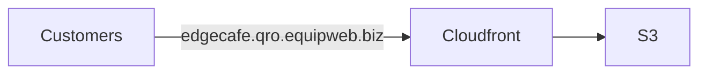

# infra

## Infrastructure

The fundamental setup involves storing the compiled code in an S3 bucket and distributing it through CloudFront. The domain name will be directed to the CloudFront CNAME.



### Objectives

1. Use IaC(Infrastructure as Code) to keep track of infrastructure changes.
2. Use the same code for all clients considering that each client will have a different `API_URL`. Also note that environment variables in ReactJs can only be given during build time.

### Solution

1. Use [terraform](https://www.terraform.io/) to automate infrastructure.
2. Following the paradigm [Convention over configuration](https://en.wikipedia.org/wiki/Convention_over_configuration), we can assemble the `API_URL` at runtime based on the domain name used. See below.

#### Naming convention

POS API URL format: `https://<server-domain>/<client-name>/ordering/api`
QRO(QR Ordering) domain name: `https://<client-name>(-<stage-name>).qro.equipweb.biz`

During build time, we will pass the `VITE_API_URL` template:

```env
VITE_API_URL=https://t1.equipweb.biz/<client-name>/ordering/api
```

**\<server-name\>** - Domain name of the server. We currently have 3 of the:

- s1.equipweb.biz
- s2.equipweb.biz
- t1.equipweb.biz

**\<client-name\>** - The folder name of the client in POS server.

**\<stage-name\>** - Optional stage name. It can be `-staging` or `-dev`. If empty, it would be production.

We will setup staging and prod for each server.

| Server          | Client    | Stage   | S3 bucket         | Cloudfront                 | Domain name                        |
| --------------- | --------- | ------- | ----------------- | -------------------------- | ---------------------------------- |
| s1.equipweb.biz | EdgeCafe  | prod    | ew-qro-prod-s1    | ds1-prod.cloudfront.net    | EdgeCafe.qro.equipweb.biz          |
| s2.equipweb.biz | WorksCafe | prod    | ew-qro-prod-s2    | ds2-prod.cloudfront.net    | WorksCafe.qro.equipweb.biz         |
| t1.equipweb.biz | EWCafe    | prod    | ew-qro-prod-t1    | dt1-prod.cloudfront.net    | EWCafe.qro.equipweb.biz            |
| s1.equipweb.biz | EdgeCafe  | staging | ew-qro-staging-s1 | ds1-staging.cloudfront.net | EdgeCafe.qro-staging.equipweb.biz  |
| s2.equipweb.biz | WorksCafe | staging | ew-qro-staging-s2 | ds2-staging.cloudfront.net | WorksCafe.qro-staging.equipweb.biz |
| t1.equipweb.biz | EWCafe    | staging | ew-qro-staging-t1 | dt1-staging.cloudfront.net | EWCafe.qro-staging.equipweb.biz    |
| s1.equipweb.biz | YohanFood | prod    | ew-qro-prod-s1    | ds1-prod.cloudfront.net    | YohanFood.qro.equipweb.biz         |
| s1.equipweb.biz | IanDrinks | prod    | ew-qro-prod-s1    | ds1-prod.cloudfront.net    | IanDrinks.qro.equipweb.biz         |

Examples on how to determine POS `API_URL` based on QRO domain name:

| QRO Domain name           | POS API URL                           |
| ------------------------- | ------------------------------------- |
| edgecafe.qro.equipweb.biz | s1.equipweb.biz/edgecafe/ordering/api |

```json
{
  "s1": [
    "edgecafe.qro.equipweb.biz",
    "yohanfood.qro.equipweb.biz",
    "iandrinks.qro.equipweb.biz"
  ],
  "s2": ["gilangicecream.qro.equipweb.biz", "albertcakes.qro.equipweb.biz"],
  "t2": ["ryanh20.qro.equipweb.biz"]
}
```

## Development

Please note that this only needs to be done if you intend to modify the infrastructure. This is not needed for local development

0. Setup AWS cli credentials
1. Setup env variables:

   ```shell
   export AWS_PROFILE=ew
   export TF_VAR_ENV=testing
   export TF_VAR_VERSION=0.0.1
   ```

2. Create [backend config](backend/)
3. `terraform init -backend-config=backend/dev.conf -backend-config="key=$TF_VAR_ENV/$TF_VAR_VERSION/terraform.tfstate"`
4. `terraform validate`
5. `terraform apply`
