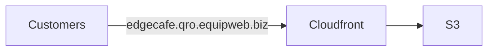
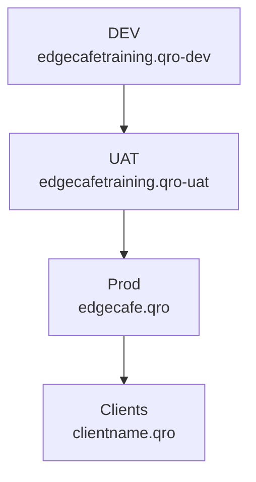
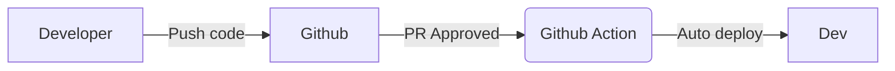
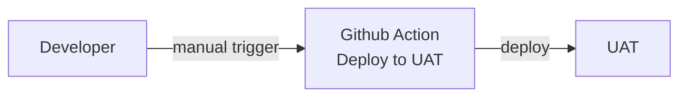
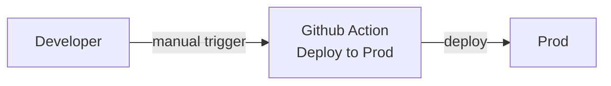
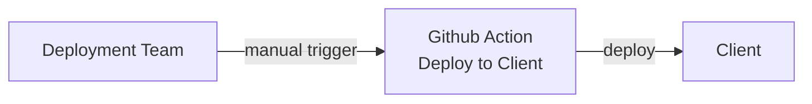

# infra

## Infrastructure

The fundamental setup involves storing the compiled code in an S3 bucket and distributing it through CloudFront. The domain name will be directed to the CloudFront CNAME.

### Naming convention

`edgecafetraining.qro-dev.equipweb.biz` - Used by developers to test in S3 and Cloudfront.

`edgecafetraining.qro-uat.equipweb.biz` - Used by QA to test a set of new features and bug fixes. This will allow the developers to continue working on new features without changing the code base that QA team is testing.

`edgecafe.qro.equipweb.biz` - This is the latest stable version tested by QA. It will be used for creating/updating client production websites.

`<clientname>.qro.equipweb.biz` - Client production website.

### Deployment Cycle

#### Deploy to Dev

- Every time a PR is merged, Github action will auto run and deploy to `Dev` environment

#### Deploy to UAT

- To deploy to `UAT`, you'll need manually trigger the `Deploy to UAT` Github action.
- This will take the version in `Dev` environment and deploy the same version to `UAT`.

#### Deploy to Prod

- To deploy to `Prod` after QA approval, you'll need manually trigger the `Deploy to Prod` Github action.
- This will take the version in `UAT` environment and deploy the same version to `Prod`.

### Deploy to Clients

- To deploy to `Client`, you'll need to manually trigger the `Deploy to Client` Github action and specify the domain name and API URL.

  Example values:

  - Domain name: `amazingcafe.qro.equipweb.biz`
  - API URL: `https://t1.equipweb.biz/EdgeCafeTraining/ordering/api`

- This will copy the most stable version(edgecafe.qro.equipweb.biz) of the app to the client website.
